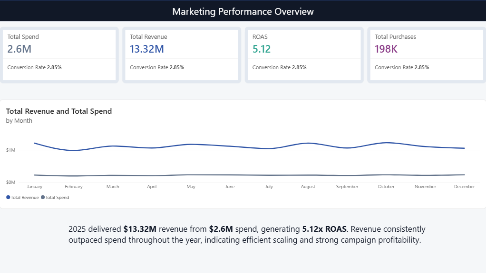
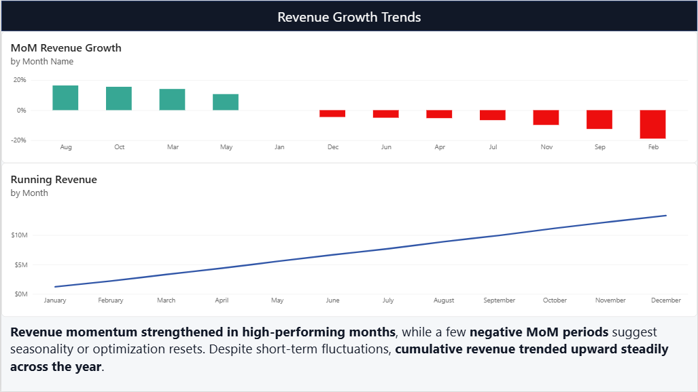
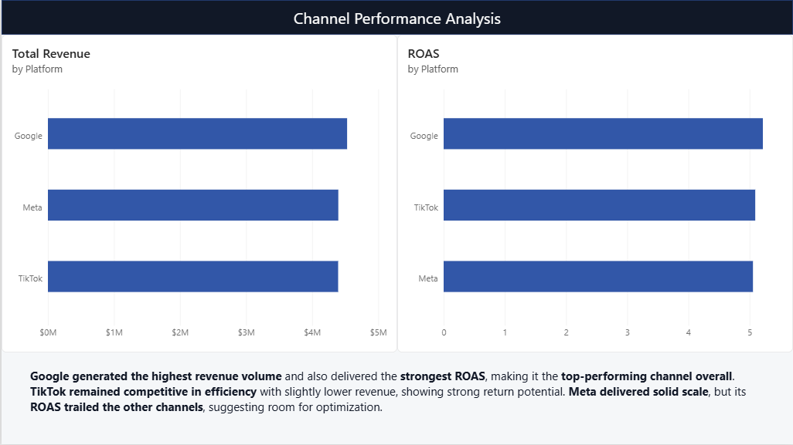
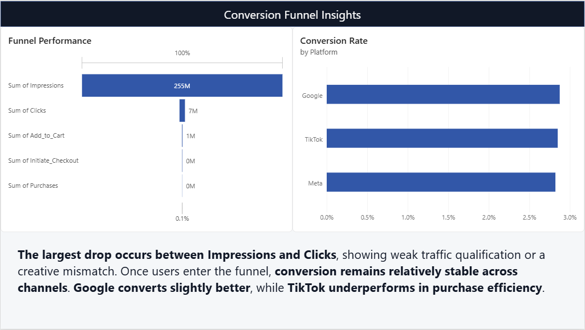
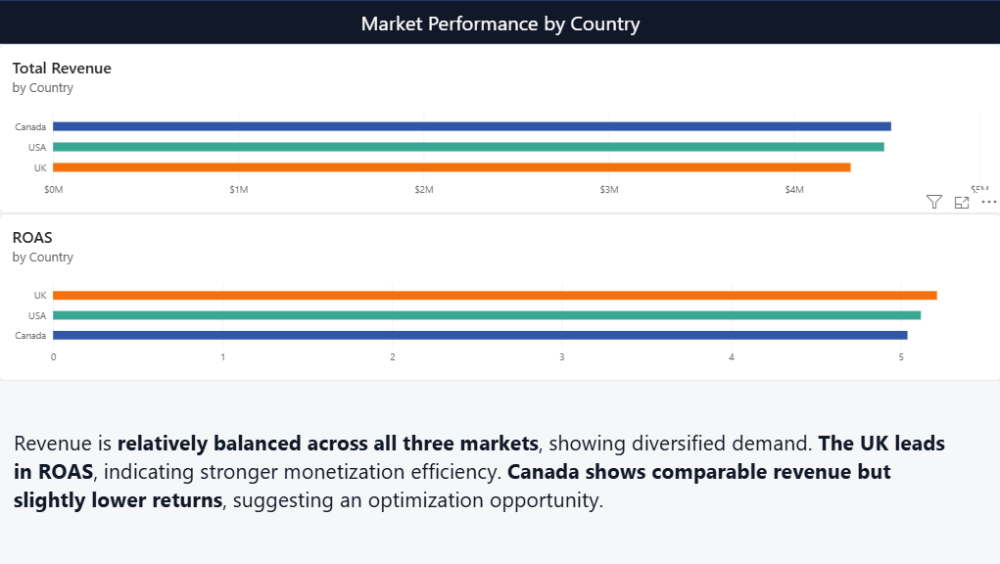
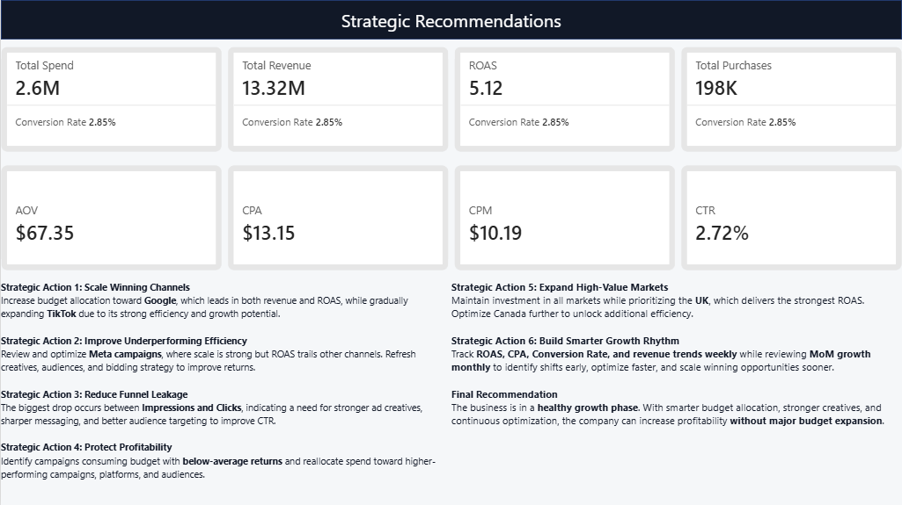

# Marketing Campaign Performance Analysis | Power BI Dashboard | Funnel Analysis | ROI Optimization

## 🚀 Executive Summary

This project transforms raw multi-channel marketing campaign data into an executive-level Power BI dashboard focused on **profitability, growth, conversion performance, and budget optimization**.

The analysis shows that **$2.6M in ad spend generated $13.32M in revenue**, delivering a strong **5.12x ROAS** and **198K purchases**. However, channel, funnel, and market differences reveal clear opportunities to scale winners and reduce inefficiencies.

This project demonstrates how data can be converted into business decisions through storytelling, DAX measures, and dashboard design.

---

# 📌 Business Problem

Marketing teams often spend across multiple platforms and markets without clear visibility into:

- Which channel performs best?
- Where is money being wasted?
- Where do users drop off in the funnel?
- Which countries deserve more budget?
- Is growth happening efficiently?

The objective was to turn raw campaign data into actionable insights for smarter decision-making.

---

# 🖼 Dashboard Preview

## 1️⃣ Marketing Performance Overview

Tracks overall business health using KPI cards and monthly trends.

### Key Insights:
- **$13.32M revenue** generated from **$2.6M spend**
- Overall profitability reached **5.12x ROAS**
- Revenue consistently stayed above spend throughout the year
- Strong evidence of efficient scaling

---

## 2️⃣ Revenue Growth Trends

Measures momentum using MoM growth and cumulative revenue.

### Key Insights:
- **Revenue momentum strengthened** in several high-performing months
- A few negative months suggest seasonality or optimization resets
- Despite fluctuations, cumulative revenue grew steadily across the year

---

## 3️⃣ Channel Performance Analysis

Compares platform contribution by revenue and ROAS.

### Key Insights:
- **Google generated the highest revenue**
- **Google also delivered the strongest ROAS**
- TikTok remained highly competitive in efficiency
- Meta provided scale, but lower returns than competitors

---

## 4️⃣ Conversion Funnel Insights

Analyzes customer journey from impressions to purchases.

### Key Insights:
- Biggest drop happens between **Impressions → Clicks**
- Indicates weak traffic qualification or creative mismatch
- Once users enter funnel, conversion remains relatively stable
- Google converts slightly better than other channels

---

## 5️⃣ Cost Efficiency & Budget Waste

Identifies waste using CPA, CPM, and campaign-level returns.

### Key Insights:
- Some campaigns absorb budget while producing weak returns
- **Meta has highest CPA**
- **Google shows lower CPM efficiency**
- Reallocating budget can improve total profitability

---

## 6️⃣ Market Performance by Country

Compares country-level revenue and profitability.

### Key Insights:
- Revenue is balanced across all three markets
- **UK leads in ROAS**
- Canada has strong revenue but lower efficiency
- Geographic optimization can unlock higher ROI

---

## 7️⃣ Strategic Recommendations

Final business actions based on the dashboard findings.

### Recommended Actions:
1. Scale high-ROAS platforms and campaigns  
2. Improve CTR through stronger creatives  
3. Fix landing pages to reduce funnel leakage  
4. Cut spend on low-return campaigns  
5. Increase investment in top-performing countries  
6. Monitor weekly KPIs for faster decisions  

---

# 🧠 Methodology

## Data Preparation
- Cleaned raw Excel dataset
- Standardized fields and formats
- Created date table for time analysis

## Data Modeling
Built a star schema model with:

- `fact_campaigns`
- `dim_platform`
- `dim_campaign`
- `dim_geo`
- `Date_Table`

## DAX Measures Created

- Total Spend  
- Total Revenue  
- Total Purchases  
- ROAS  
- CPA  
- CPM  
- CTR  
- Conversion Rate  
- Running Revenue  
- MoM Revenue Growth  
- AOV  

---

# 🛠 Skills Demonstrated

## Power BI
- Dashboard Design
- Data Modeling
- Interactive Reporting
- Storytelling with Data

## DAX
- CALCULATE()
- DIVIDE()
- DATEADD()
- Running Totals
- Time Intelligence

## Excel
- Data Cleaning
- Validation
- Structuring Raw Data

## Business Analytics
- Funnel Analysis
- Marketing Performance Analysis
- ROI Optimization
- Strategic Recommendations

---

# 📈 Business Impact

This dashboard helps stakeholders:

- Increase marketing profitability
- Improve budget allocation
- Detect weak campaigns faster
- Optimize funnel performance
- Scale winning channels and markets
- Make faster data-driven decisions

---

# 🔮 Next Steps

Future enhancements could include:

- A/B testing insights
- Forecasting revenue trends
- Customer segmentation
- New vs Returning customer analysis
- Attribution modeling
- Automated refresh with Power BI Service

---

# Author

**Ziad Diab**
Marketing Data Analyst | E-commerce Data Analyst

---

# ⭐ If you found this useful, consider giving it a star!
